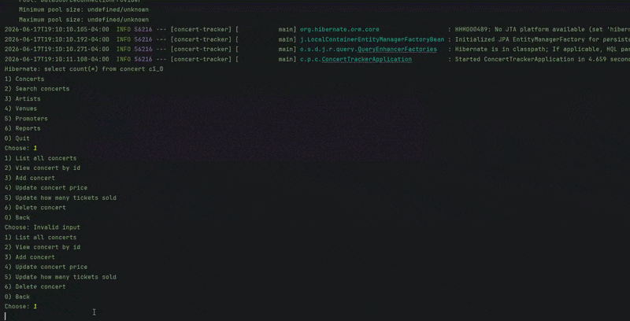

# Concert Tracker

## Description of the Project

The concert tracker program I made helps keep track of live music events. It lets you manage Artists, Venues, and Promoters.

## User Stories
- As a developer, I want four entities to define the mapping between Java objects and database tables
- As a developer, I want to set up the data layer
- As a developer, I want to seed and verify the data
- As a developer I want to manage the concerts
- As a developer I want to Manage venues
- As a developer I want to manage artists
- As a developer I want to manage promoters
- As a developer, I want filter concerts by year
- As a developer, I want to filter search by artist
- As a developer, I want to filter search by venue
- As a developer, I want to filter search by city
- As a developer, I want to filter search by price range
- As a developer, I want to filter search by advanced combination
- As a developer, I want aggregate Revenue per venue
- As a developer, I want aggregate Busiest venue and busiest artist
- As a developer, I want aggregate Average ticket price by year
- As a developer, I want aggregate Capacity report

## Setup

1. Open IntelliJ IDEA.
2. Open the Concert Tracker project
3. Locate the ConcertTrackerApplication.java file
4. Right-click the file and select "Run 'ConcertTrackerApplication.main()'"

### Prerequisites

- IntelliJ IDEA: Ensure you have IntelliJ IDEA installed, which you can download from [here](https://www.jetbrains.com/idea/download/).
- Java SDK: Make sure Java SDK is installed and configured in IntelliJ.

### Running the Application in IntelliJ

Follow these steps to get your application running within IntelliJ IDEA:

1. Open IntelliJ IDEA.
2. Select "Open" and navigate to the directory where you cloned or downloaded the project.
3. After the project opens, wait for IntelliJ to index the files and set up the project.
4. Find the main class with the `public static void main(String[] args)` method.
5. Right-click on the file and select 'Run 'YourMainClassName.main()'' to start the application.

## Technologies Used

- Java 17
- Git/GitHub

## Demo

## Resources

- [Java Visual Learning Hub](https://raymaroun.github.io/yearup-java-visuals/)
- [My Past Projects/Exersices](https://github.com/CraftedByAdam?tab=repositories)
- [Raymond's Uploaded Projects/Exersices solutions](https://github.com/RayMaroun/yearup-spring-section-8-2026/tree/main/pluralsight/java-development)

## Thanks

- Thank you to Raymond Maroun for continuous support and guidance.